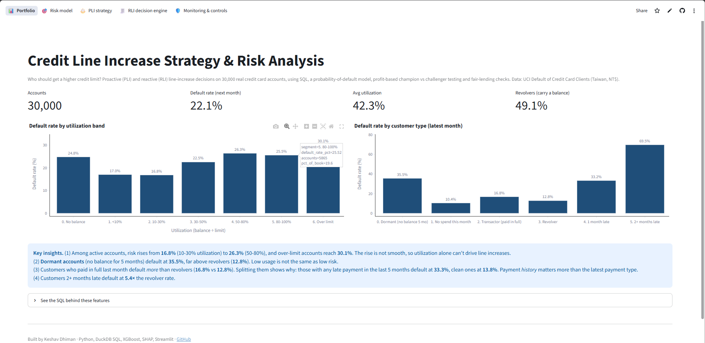
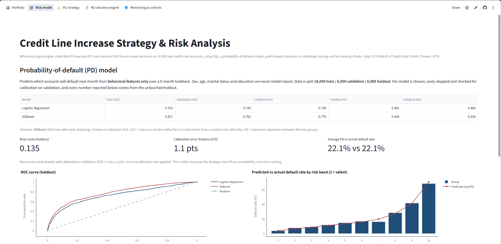
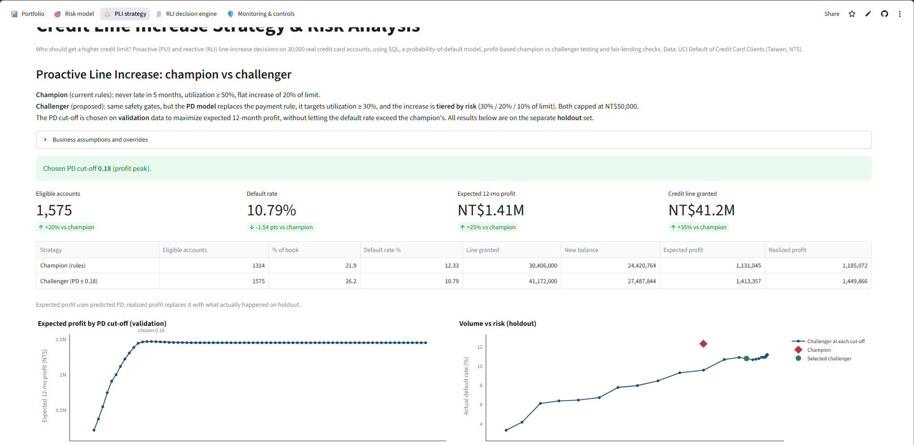
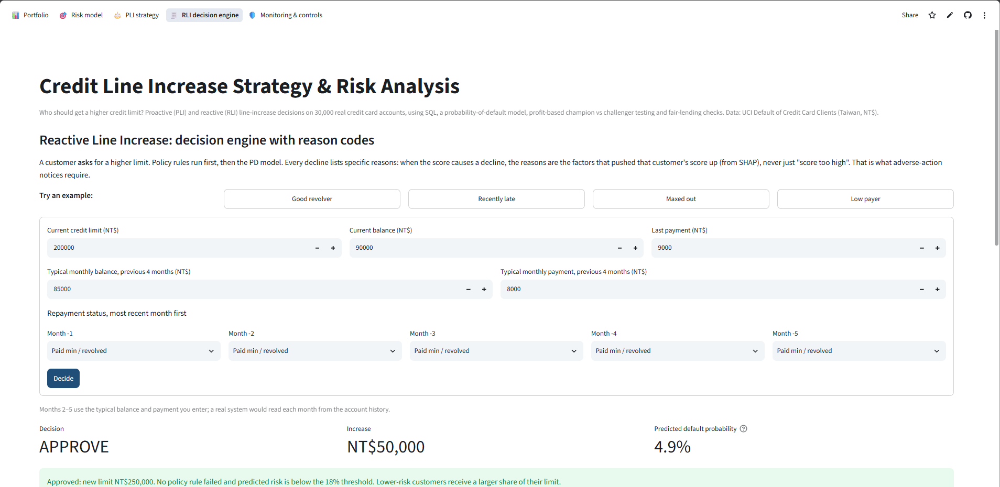
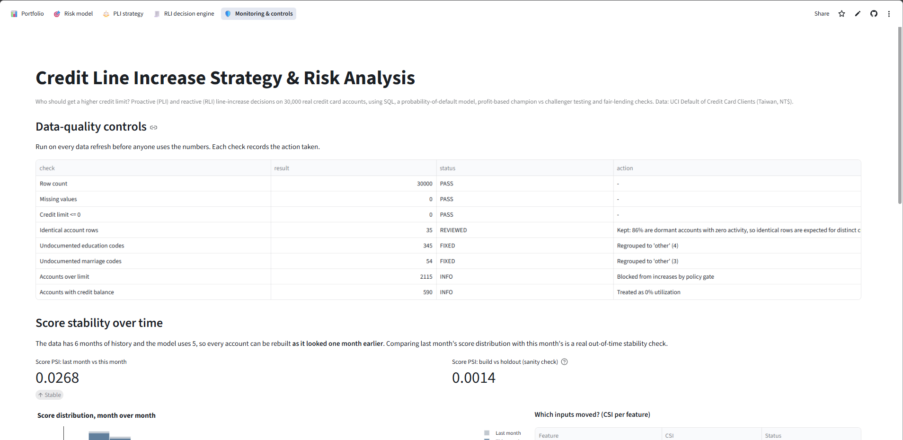

# Credit Line Increase Strategy & Risk Analysis

**Who should get a higher credit limit?** An end-to-end analysis of proactive (PLI) and reactive (RLI) credit line increase decisions on 30,000 real credit card accounts: SQL feature engineering, a calibrated probability-of-default model, a profit-based champion vs challenger test, an explainable decision engine, and stability and fair-lending monitoring.

### 🔗 [Live app](https://credit-line-increase-strategy.streamlit.app) · [Notebook](notebooks/credit_line_increase_strategy.ipynb)



## Business problem
Card issuers grow balances by raising credit limits, but giving more credit to the wrong customer increases losses. A good strategy gives more line to customers who will **use** it and **repay** it, and has to explain every decline.

| Question | Where it's answered |
|---|---|
| How do usage and repayment behaviour relate to default risk? | Portfolio |
| Can a model rank customers by default risk, and are its probabilities accurate? | Risk model |
| Does a model-based strategy make more money than today's rules without more risk? | PLI strategy |
| How should a request for more credit be decided, with specific reasons? | RLI decision engine |
| Is the score stable over time, and is the strategy fair across groups? | Monitoring & controls |

## Key results
All results are on a **holdout set (6,000 accounts)** that was never used for training, model choice, calibration or cut-off tuning.

- **Risk model:** XGBoost reached **AUC 0.779, KS 0.436, Gini 0.558** on behavioral features only (logistic regression: AUC 0.730). Predicted PD is well calibrated: average PD 22.1% vs 22.1% actual, calibration error 1.1 pts.
- **PLI strategy:** with the PD cut-off (0.18) chosen on validation to maximize expected profit, the challenger approves **20% more accounts** (1,575 vs 1,314) at a **lower default rate (10.8% vs 12.3%)**, granting 35% more credit line for **25% more expected 12-month profit**.
- **Swap sets:** the 369 accounts the challenger adds default at **7.1%**; the 108 it drops default at **16.7%**.
- **Insights:** dormant accounts (no balance for 5 months) default at **35.5%**, nearly 3× revolvers (12.8%), so low usage is not low risk. Customers who paid in full default more than revolvers, driven by those with recent late payments (33% vs 14%).
- **RLI engine:** 56% approval rate. Every decline carries specific reasons, and score-based declines are explained by the customer's own top SHAP drivers. A candidate repayment-ratio rule was **tested and retired**: it would have declined 1,048 more accounts that default at 11.4% vs 9.7% for those approved.
- **Monitoring:** month-over-month score PSI **0.027** (stable), using a genuine one-month-earlier snapshot rebuilt from the 6-month history.
- **Fair lending:** the rule-based champion fails the four-fifths rule for two age groups; the challenger brings the approval rates of most groups within it, with one group (35–44, AIR 0.76) left for review.

## Screenshots
| Risk model | PLI strategy |
|---|---|
|  |  |

| RLI decision engine | Monitoring & controls |
|---|---|
|  |  |

## Approach
| Step | What | Tools |
|---|---|---|
| 1 | Data-quality controls with a recorded action for every check | Pandas |
| 2 | Snapshot features and segment analysis (5-month lookback; rebuilt one month earlier for monitoring) | SQL (DuckDB) |
| 3 | PD model: logistic regression vs XGBoost with early stopping; 60/20/20 train/validation/holdout split; calibration check | scikit-learn, XGBoost |
| 4 | PLI champion vs challenger: profit model, risk-tiered increases, cut-off tuned on validation, swap-set analysis | Python |
| 5 | RLI decision engine: policy rules + SHAP-based reason codes, with validation of each rule | XGBoost SHAP |
| 6 | Monitoring: month-over-month PSI, per-feature CSI, adverse impact ratio by sex and age | Python |
| 7 | Interactive dashboard reading pre-built artifacts (no training on the server) | Streamlit, Plotly |

**Fair lending:** sex, age, marital status and education are never model inputs. Sex and age are used only to test outcomes.

## Project structure
```
├── app.py                      # Entry point: page navigation only
├── views/                      # One file per dashboard page
├── ui/                         # Chart builders, cached artifact loaders, error display
├── clis/                       # Core package (no Streamlit imports)
│   ├── config.py               # Features, policy thresholds, sizing, profit assumptions
│   ├── errors.py               # DataLoadError, SchemaError, ArtifactError, StrategyError
│   ├── data/                   # Loading and data-quality controls
│   ├── features/               # DuckDB feature build + .sql files
│   ├── model/                  # Training, portable scoring model, evaluation
│   ├── strategy/               # Policy gates, economics, PLI cut-off selection
│   ├── decision/               # RLI engine and reason codes
│   ├── monitoring/             # PSI/CSI stability and fairness
│   └── artifacts.py            # Read/write of saved results
├── scripts/build_artifacts.py  # Offline pipeline: data -> model -> strategy -> artifacts
├── artifacts/                  # Model (JSON, no pickles) and result tables the app reads
├── tests/                      # pytest suite on synthetic data
├── notebooks/                  # First exploratory pass (70/30 split; numbers differ from the app)
└── data/                       # UCI_Credit_Card.csv (see data/README.md)
```

## Run it locally
```bash
pip install -r requirements-dev.txt
python scripts/build_artifacts.py   # ~5 seconds; rerun after changing any logic
pytest -q
streamlit run app.py
```

## Limitations and next steps
- Target is default **next month**; production line-increase models predict over 12+ months. The profit model treats this PD as the horizon default probability.
- No income, months-on-book or bureau data, so increase amounts are simple risk tiers.
- Profit assumptions (APR, LGD, drawdown at default) are illustrative and adjustable in the app.
- One 2005 snapshot; true out-of-time validation would need later cohorts.
- A real rollout would A/B test the challenger on a small random group and track 30/60/90-day delinquency by vintage.

## Data
Yeh, I. C. (2009). *Default of Credit Card Clients* [Dataset]. UCI Machine Learning Repository. https://doi.org/10.24432/C55S3H (CC BY 4.0). Taiwan, 2005; amounts in NT$.

---
Built by **Keshav Dhiman** · [LinkedIn](https://www.linkedin.com/in/keshav-dhiman-85164724a/)
